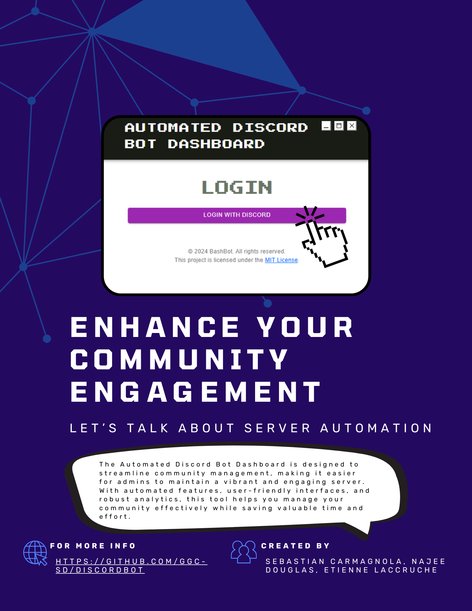

# DiscordBot

# Fall 2023
## Description
- The plan is to automate the cleaning of a Discord server by creating a dedicated Discord bot. The bot will respond to a command and work on a set schedule. It will have configurable options, a customizable blacklist, and a preview feature to show which inactive members are going to be removed.

## Technologies Used
- JavaScript
- [Node.js](https://nodejs.org/en/)

## Bit Bot Boot Team Roles
**Gabriel Kerven**
https://github.com/GGC-SD/DiscordBot.git
1. Lead Programmer
2. Client liasion
   :boom:

***Alexis Pardo***
1. UI/UX Design :pencil2:
2. Testing lead :computer:

***Ravjot Singh***
https://github.com/GGC-SD/DiscordBot.git
1. Data Modeler
2. Team Manager :raising_hand_man:

***Chidiebube Okebalama***
https://github.com/GGC-SD/DiscordBot.git
1. Lead Programmer :floppy_disk:
2. Documentation Lead :bookmark_tabs:

## Communication Tools
- Discord

## Repo Location
- [Repo Link](https://github.com/GGC-SD/DiscordBot.git)

## Progress Tracking Tool
- Jira
- [Progress tool Link](https://jira.ggc.edu/secure/RapidBoard.jspa?rapidView=29&projectKey=SDAD&view=planning&selectedIssue=SDAD-249&epics=visible&issueLimit=100)

## Set Up
- Using your Operating Systems Terminal set the ExecutionPolicy. Use the command: Set-ExecutionPolicy RemoteSigned -Scope CurrentUser.
- The RemoteSigned is also a safe PowerShell Execution policy to set in an enterprise environment. This policy dictates that any script that was not created on the system that the script is running on, should be signed. Therefore, this will allow you to write your own script and execute it. You would not be able to run a script that was downloaded from the Internet, or got from a friend who wrote it under his account or on a different computer. PowerShell differentiates between script you wrote on that computer, and a script that came from elsewhere using the file metadata.
- (The scope makes the RemoteSigned only effect a single user instead of allowing all the users to become effected by the terminal command. This is a security precaution.)
- Install <a href = "https://nodejs.org/en">Node.js</a>. and its dependency <a href = "https://community.chocolatey.org/packages/nodejs.install">Chocolatey</a>.
- Initialize the bots project using command npm init -y.
- Install nodemon using the terminal and the command npm install -g nodemon (nodemon installation allows the script to run continuously in the background while also autoupdating anytime script is changed in the bot project and saved allowing all changes to be quickly deployed for the bot).
- Install dotenv on using the terminal and the command npm install dotenv (This causes allows your bot project a place for the bots token to be stored later in the project and then be placed into a gitignore file in order to keep your token and other confidential project information safe if the bot is shared on GitHub.)
- Install discord.js using the terminal and the command npm i discord.js.
- Create a Discord bot on the Discord bot <a href = "https://discord.com/login?redirect_to=%2Fdevelopers%2Fapplications%2F">Discord Developer Portal</a>.
- Add the bot's token (Discord developer Portal-> application-> "specific app"-> bot -> Reset Token) to config.json and adjuste the configuration to indicate where the script is on your local machine.
- Run the bot by using nodemon or nodemon index.js or any other command you prefer.

## List of working features
- ***Help command:*** Lists out all the different configuration commands for the bot.
- ***Blacklist show command:*** Shows the current blacklisted user/roles. Blacklisted users will not be purged from the server.
- ***Blacklist add command:*** Lets you add a specific user/role to the blacklist which makes them bypass the purges.
- ***Blacklist remove command:*** Lets you remove a specific user/role from the blacklist.
- ***Blacklist Database:*** Stores user data for the blacklist.
- ***Show inactivity command:*** Shows members who are considered "inactive" that are eligible to be purged.

## Project Licencing
- <a href = "https://github.com/GGC-SD/DiscordBot">Order 66</a> © 2023 by <a href = "https://github.com/GGC-SD/DiscordBot/graphs/contributors" target = "_blank">Gabriel Kerven, Chidiebube Okebalama, Alexis Pardo, Ravjot Singh, Anca Doloc Mihu, David Rivera, Mike Deiters</a> is licensed under <a href = "https://creativecommons.org/licenses/by-nd/4.0/?ref=chooser-v1" target = "_blank">CC BY-ND 4.0</a>

# Fall 2024
## Description
- Discord is a communication platform designed for creating communities, where users can interact through text, voice, and video channels, while Discord bots are automated programs that can perform tasks such as moderating conversations, managing users, or providing entertainment within these communities. Our team has been tasked with creating a discord bot that can moderate servers. It is able to track activity across multiple channels and can purge users who have been deemed inactive for too long in order to keep the server lean. The main goal is to have this process done in an automated fashion periodically, and for the admins to be able to log into a dashboard to alter settings as needed.

## Links
- [Repo Link](https://github.com/GGC-SD/DiscordBot.git)
- [Documentation Link](documents/docs-Fall2024)

## Technologies
- JavaScript
- [Node.js](https://nodejs.org/en/)

     ### <ins>*Updates Fall 2024*</ins>
- React (https://react.dev/)
- Material UI (https://mui.com/material-ui/)
- Express.js (https://expressjs.com/)
- MongoDB (https://www.mongodb.com/)
- Axios (https://axios-http.com/docs/intro)
- Dotenv (https://www.npmjs.com/package/dotenv)

## Working Features
1. ***Dashboard:*** The bot now has an authenticated login for admins only web based UI dashboard that, in the future, will be the only point of interaction with the bot. 
    - Login page which authenticates whether a user has an admin role to access the dashboard.
    - Pages for each command that are accessible from the hamburger in the navbar under 'Commands' which open the sidebar on the left of the page. 
      - User Activity - displays an overview of user activity within the application, including their latest messages, reactions, and voice interactions in the ford of an interactive table.
      - Inactivity - displays an overview of inactive users within the application in the form of an interactive table.
      - Purge - displays an overview of inactive users and a history of whom commited a purge.
      - Blacklist - displays an overview of all blacklisted users within the application. Allows the user to select users from the table to remove them from the blacklist.
      - Roles & Timers - displays two tables: User Roles and Role Timer. User Roles provides an overview of each individual users information, including their username, and user id, along with their role names (multiple roles if applicable) in the form of an interactive table. Role Timer an overview of the roles and timer for users within the application.
     - FAQ page displays an accordion of question and commands which are parsed from JSON files in the JSON folder within the frontend JSON folder.
    - 'Logout' button.
    - 'Account' button that currently leads to a skeleton page.
    - 'Home' button to take the user back to the welcome landing page.
2. ***Discord Server - Slash Commands*** Pertains to the commands entered within the server.
    - <ins>/help:</ins> Lists out all the different configuration commands for the bot.
   - <ins>/blacklist show:</ins> Shows the current blacklisted user/roles.
   - <ins>/blacklist add (user/role)</ins> Lets you add a specific user/role to a blacklist which makes them bypass the purges.
   - <ins>/blacklist remove (user/role):</ins> Lets you remove a specific user/role from the blacklist.
   - <ins>/purge:</ins> Starts a manual purge which will removed inactive users from server and send confirmation to specified channel.
   - <ins>/roletimer (role name) (amount of time in days):</ins> Sets the grace period for a certain role.
   - <ins>/setpurge (time in days):</ins> Sets the specified automated purge window (in days).
   - <ins>/timer (role) (time)</ins> Sets a time window (in days) for a role before considering them inactive.
   - <ins>/show inactivity:</ins> Shows members who are considered 'inactive' that are eligible to be purged.

## Installation Steps
- Using your Operating Systems Terminal set the ExecutionPolicy. Use the command: Set-ExecutionPolicy RemoteSigned -Scope CurrentUser.
- The RemoteSigned is also a safe PowerShell Execution policy to set in an enterprise environment. This policy dictates that any script that was not created on the system that the script is running on, should be signed. Therefore, this will allow you to write your own script and execute it. You would not be able to run a script that was downloaded from the Internet, or got from a friend who wrote it under his account or on a different computer. PowerShell differentiates between script you wrote on that computer, and a script that came from elsewhere using the file metadata.
- (The scope makes the RemoteSigned only effect a single user instead of allowing all the users to become effected by the terminal command. This is a security precaution.)
- Install <a href = "https://nodejs.org/en">Node.js</a>. and its dependency <a href = "https://community.chocolatey.org/packages/nodejs.install">Chocolatey</a>.
- [Removed: Initializing the bot manually is unnecessary with the current setup.] 
- Install nodemon using the terminal and the command npm install -g nodemon (nodemon installation allows the script to run continuously in the background while also autoupdating anytime script is changed in the bot project and saved allowing all changes to be quickly deployed for the bot).
- Create a Discord bot on the Discord bot <a href = "https://discord.com/login?redirect_to=%2Fdevelopers%2Fapplications%2F">Discord Developer Portal</a>.
- Add the bot's token (Discord developer Portal-> application-> "specific app"-> bot -> Reset Token) to config.json and adjuste the configuration to indicate where the script is on your local machine.
- Run the bot by using nodemon or nodemon index.js or any other command you prefer.
- Add database token (Go to your MongoDB account. Under 'Database' select Clusters. Select the corresponding DB, Select the Connect button. Under 'Connect to your application', select Drivers. Follow the instructions to complete the setup and get the token for the database.)
- Add guild id, in the Discord app, right-click on the Server Icon. Select copy Server ID.

   ### <ins>*Updates 2024*</ins>
- cd into src active directing for all installations from here.
- Install dotenv on using the terminal and the command `npm install dotenv` (This causes allows your bot project a place for the bots token to be stored later in the project and then be placed into a gitignore file in order to keep your token and other confidential       project information safe if the bot is shared on GitHub.)
- Install discord.js using the terminal and the command `npm i discord.js`.
- Install express.js using the terminal and the command `npm i express` (Allows for a simple web server framework to handle requests received from the frontend app.)
- Install mongoose using the terminal and the command `npm i mongoose` (Enables database integration with MongoDB so the app can read and write to the database.)
- Install cors using the terminal and the command `npm i cors` 
- Install axios using the terminal and the command `npm i axios` (Allows front end to fetch data from the server for displaying in the UI.)
- Install the react router dom using the terminal and the command `npm i react-router-dom` (Helps set up webpage routing on the server.)
- Install react scripts using the terminal and the command `npm i react-scripts` --save

## Setup Dotenv
- In the src folder, create a new file named .env which will hold the:
  - **TOKEN** (your discord bot token)
  - **databaseToken** (your MongoDB token)
  - **GUILD_ID** (your server id)
  - **CLIENT_ID** (found on the discord developer portal -> click the hamburger -> OAUth2 -> Client Information)
  - **CLIENT_SECRET** (found on the discord developer portal -> click the hamburger -> OAUth2 -> Client Information)
  - **REDIRECT_URI**  (found on the discord developer portal -> click the hamburger -> OAUth2 -> Redirects)

## How To Run
- From the src active directory, type `npm start` in the terminal and the bot, server, and react app will all start automatically. You will then see a login webpage appear in the browser automatically, presenting the admin login page for the dashboard.
- In your IDE terminal you will see logs to aid in tracing how the code runs
- In order to get past the admin login page, you must configure the .env with all the necessary fields

## Neck Beard Team Roles
**Sebastian Lian Carmagnola**
https://github.com/GGC-SD/DiscordBot.git

1. Data Modeler :space_invader:
2. Testing Lead :keyboard:

**Najee Douglas**
https://github.com/GGC-SD/DiscordBot.git

1. UI/UX Design :file_folder:
2. Documentation Lead :scroll:

**Etienne Laccruche**
https://github.com/GGC-SD/DiscordBot.git

1. Lead Programmer 💻
2. Client Liaison 🧑‍🤝‍🧑

**Jonathan Hummel**
1. Lead Programmer ⭐
2. Team Manager 🏴‍☠️

## Project Flyer & Video

[Watch the demo video on YouTube](https://youtu.be/qnSWJWxF50M?si=Gzr8XobdUlc2RazH)

## License
<a href="https://github.com/GGC-SD/DiscordBot">BashBot</a> © 2024 by <a href="https://github.com/GGC-SD/DiscordBot/graphs/contributors" target="_blank">Sebastian L. Carmagnola, Najee Douglas, Etienne Laccruche, Jonathan Hummel, Anca Doloc Mihu, David Rivera, Mike Deiters</a> is licensed under the <a href="https://opensource.org/licenses/MIT" target="_blank">MIT License</a>. See the [LICENSE](./documents/docs-Fall2024/License.md) file for details.
